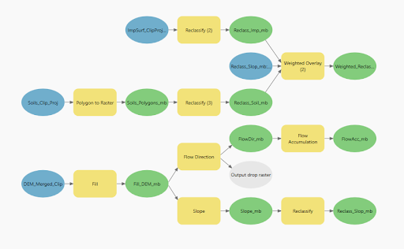

# Geospatial Programming Final Project

This project models relative runoff risk using a weighted overlay approach
implemented in ArcGIS Pro, ModelBuilder, and Python (ArcPy).

## ModelBuilder Workflow


## Metadata / Data Availability
The data used for this final project originated from a variety of sources. The digital elevation model tiles were pulled from the USGS National Map Viewer. Three, 1/3 Arc Second tiles each with spatial resolution of 9.259259m were used in the projection NAD83. DEM data was collected as recent as November 20, 2021. Fractional impervious surface data was collected from the Multi-Resolution Land Characteristics Consortium. These data were downloaded for 2021, and used the projection AEA_WGS84 with a spatial resolution of 30m. A polygon layer of hydrologic group soils was downloaded via the ArcGIS Online portal and originated from the USDA Web Soil Survey. The polygon feature class has a projected coorinate system of NAD 1983 HARN StatePlane Arizona Central FIPS 0202 (Intl Feet). Add watershed and ward boundaries.

## Overview
The model integrates:
- Slope derived from a DEM
- Impervious surface cover
- Soil runoff risk

Each layer is reclassified and combined using a weighted overlay to produce
a relative runoff risk index (1 = low, 5 = high).

## Software
- ArcGIS Pro
- Spatial Analyst
- ArcPy (Python)

## Running the Code
Run the script inside an ArcGIS Pro Notebook:
```python
exec(open("runoff_model.py").read())
